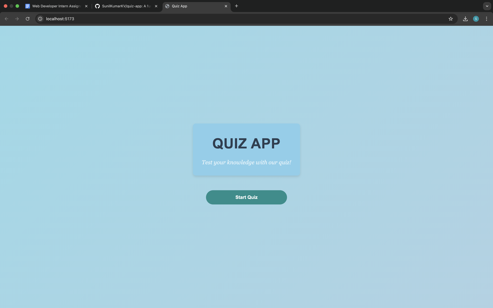
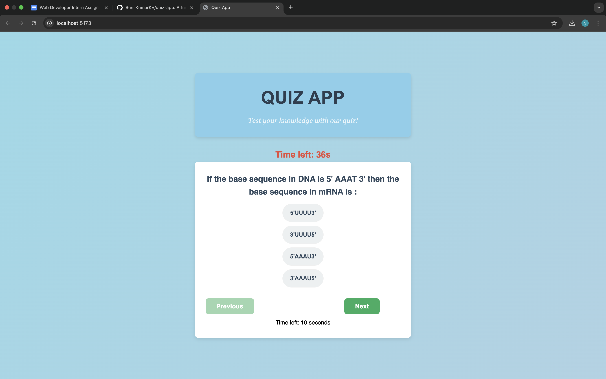
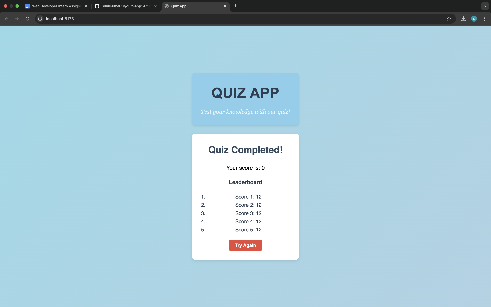

# Quiz App with Gamification

Welcome to the **Quiz App**! This is a simple, interactive web-based quiz application built with **React**. The app allows users to test their knowledge with multiple-choice questions, track their score, and see a summary of their performance at the end.

## Features

- **Start Quiz**: Click to begin the quiz.
- **Timed Questions**: Answer each question within 10 seconds for extra points.
- **Score Multiplier**: Get bonus points for consecutive correct answers.
- **Multiple-Choice Questions**: Answer questions with multiple-choice options.
- **Results Summary**: After completing the quiz, view a summary of the total score and a breakdown of performance.
- **Score Tracking**: Track correct streaks and use time-based multipliers to calculate scores.
- **Leaderboard**: Track and display scores at the end of the quiz.
- **Responsive Design**: The app is responsive and works well on mobile, tablet, and desktop.

## Technologies Used
- React.js
- JavaScript (ES6)
- HTML/CSS

### Quiz Start:


### Multiple Choice Questions Page:


### Results Summary:


---
## Check out the Video Walkthrough

You can watch the video walkthrough of the project on my [LinkedIn post](https://www.linkedin.com/posts/sunilkumarkv44_webdevelopment-gamification-reactjs-activity-7291135439237746688-rjyX?utm_source=share&utm_medium=member_desktop).


---

## Project Setup Instructions

### Prerequisites

Before you begin, make sure you have the following installed on your machine:

- **Node.js**: To run the app locally. [Download Node.js](https://nodejs.org/)
- **npm or yarn**: For managing dependencies. npm comes bundled with Node.js, but you can also use yarn if preferred.

### Installation

1. **Clone the repository** to your local machine:

   ```bash
   git clone https://github.com/SunilKumarKV/quiz-app.git
   ```

2. **Navigate** to the project directory:

   ```bash
   cd quiz-app
   ```

3. **Install the dependencies:**

Using npm:

```bash
npm install
```

Or, using yarn:

```bash
npm install
```

4. **Run the application locally:**

Using npm:

```bash
npm run dev
```

Or, using yarn:

```bash
yarn dev
```

Your app will be available at http://localhost:5173 in your browser.
